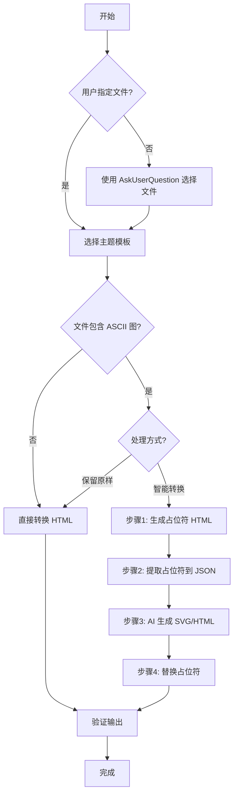

# Converting Markdown to HTML

将 Markdown 文档转换为美观的 HTML，支持多主题切换，适合领导查阅和展示。

## Quick Start

```bash
# 指定文件，使用默认主题（purple）
python3 scripts/convert.py document.md

# 指定文件和主题
python3 scripts/convert.py document.md --theme blue

# 列出所有可用主题
python3 scripts/convert.py --list-themes
```

## Features

- ✅ **多主题支持**：purple（紫色）、blue（蓝色）、green（绿色）、minimal（极简灰度）
- ✅ 响应式设计（PC/平板/手机）
- ✅ 打印优化（自动移除渐变和阴影）
- ✅ **智能段落合并**：使用专业库，无多余`<br>`标签
- ✅ **ASCII图清晰显示**：用等宽字体保留，结构准确
- ✅ **智能 SVG 转换**：AI Agent 将 ASCII 图转换为精美 SVG/HTML
- ✅ 稳定的转换逻辑（Python 脚本，依赖 markdown + PyYAML）

## ⚠️ 重要约束：UI 图必须静态展示

**对于 UI 类型的 ASCII 图（弹出窗、对话框、表单等）：**

❌ **禁止：**
- 使用 JavaScript 控制显示/隐藏
- 使用 `onclick`、`onhover` 等事件处理
- 使用 `display: none` 隐藏内容
- 需要用户交互才能看到完整内容

✅ **必须：**
- **所有内容直接显示在文档中**
- 使用纯 HTML/CSS，不用 JavaScript
- 目标是**展示设计效果**，不是实现功能
- 适合打印和导出 PDF

**示例对比：**
```html
<!-- ❌ 错误：可交互弹窗 -->
<button onclick="showModal()">打开</button>
<div id="modal" style="display:none;">弹窗内容</div>

<!-- ✅ 正确：静态展示 -->
<div style="background: linear-gradient(135deg, #667eea 0%, #764ba2 100%);
            border-radius: 12px; padding: 24px;">
  <h3>弹窗标题</h3>
  <p>弹窗内容直接显示</p>
</div>
```

## Available Themes

| Theme | Name | Colors | Use Case |
|-------|------|--------|----------|
| **purple** | 紫色渐变主题 | #667eea → #764ba2 | 售前方案、商务文档 |
| **blue** | 蓝色科技主题 | #1890ff → #096dd9 | 技术文档、API 文档 |
| **green** | 绿色清新主题 | #52c41a → #389e0d | 内部报告、运营数据 |
| **minimal** | 极简灰度主题 | 灰度系 | 学术论文、正式报告 |

## Usage

### Command Line Options

```bash
# 基本用法
python3 scripts/convert.py [markdown_file] [options]

# 选项：
#   --theme, -t    主题名称（默认：purple）
#   --list-themes, -l  列出所有可用主题

# 示例：
python3 scripts/convert.py "文档.md"                    # 默认紫色主题
python3 scripts/convert.py "文档.md" --theme blue       # 蓝色主题
python3 scripts/convert.py "文档.md" --theme green      # 绿色主题
python3 scripts/convert.py "文档.md" --theme minimal    # 极简主题
python3 scripts/convert.py --list-themes               # 列出所有主题
```

### Interactive Mode

脚本为纯命令行工具，不接受交互式输入。所有参数通过命令行参数传入。

## AI 交互流程

当使用本 skill 时，AI Agent 应按以下流程与用户交互：

### 流程概述



### 快速参考

| 步骤 | 操作 | 说明 |
|------|------|------|
| **步骤1** | 选择 Markdown 文件 | 使用 `AskUserQuestion` 工具 |
| **步骤2** | 选择主题 | purple/blue/green/minimal |
| **步骤3** | 处理 ASCII 图 | 保留原样 OR 智能转换（3步流程） |
| **步骤4** | 验证输出 | 检查清单见"验证规则"章节 |

### ⚠️ AI Agent 执行规范

**执行脚本时的重要规则：**

1. **使用完整路径调用脚本**：确保脚本能被找到
2. **使用完整路径指定输入文件**：避免文件找不到
3. **不要 cd 切换目录**：保持当前工作目录不变
4. **明确输出位置**：告知用户 HTML 文件的生成位置

**❌ 错误示例：**
```bash
# 错误1：切换目录（会改变工作目录）
cd /path/to/skill && python3 scripts/convert.py document.md

# 错误2：使用相对路径（可能找不到文件）
python3 scripts/convert.py ../../document.md
```

**✅ 正确示例：**
```bash
# 方法1：使用绝对路径（推荐）
python3 /path/to/skill/scripts/convert.py /path/to/document.md --theme blue

# 方法2：先 cd 到项目目录，再执行
cd /path/to/project
python3 /path/to/skill/scripts/convert.py document.md --theme blue
```

**执行后告知用户：**
```
✅ 转换完成！
📄 输入文件：/path/to/document.md
📄 输出文件：/path/to/document.html
📊 文件大小：XX KB
💡 提示：HTML 文件与 Markdown 文件在同一目录
```

### 步骤1：选择 Markdown 文件

如果用户未指定文件，使用 `AskUserQuestion` 工具让用户选择。

### 步骤2：选择主题模板 ⚠️ 必须先完成此步骤

使用 `AskUserQuestion` 工具展示主题选项：
- **purple** - 紫色渐变（售前方案、商务文档）
- **blue** - 蓝色科技（技术文档、API文档）
- **green** - 绿色清新（内部报告、运营数据）
- **minimal** - 极简灰度（学术论文、正式报告）

**重要**：主题选择会影响后续图形的颜色，必须先确定主题。

### 步骤3：处理 ASCII 图 ⚠️ 检测文档并询问处理方式

**检测文档是否包含 ASCII 图**（识别 ` ```ascii:类型 ` 代码块）

支持 5 种图形类型：
- `architecture` - 系统架构图
- `flowchart` - 流程图
- `ui` - UI 界面图
- `timeline` - 时间线图
- `diagram` - 通用图

**如果包含 ASCII 图，询问用户处理方式：**

#### 选项1：保留原样
- 直接调用 `python3 scripts/convert.py [file] --theme [theme]`
- ASCII 图用等宽字体显示
- 适合快速预览

#### 选项2：智能转换 SVG（3 步流程）

**子步骤 1：生成带占位符的 HTML**
```bash
AI_SVG_CONVERSION=true python3 scripts/convert.py [file] --theme [theme]
```

**子步骤 2：提取占位符到 JSON**
```bash
python3 scripts/extract_placeholders.py [file.html]
```

**子步骤 3：AI 使用多 Task 并行生成 SVG/HTML**

**🔴 核心要求：如果有 Task 工具，必须使用 Task 工具实现并行**

| 方式 | 耗时（8个图） | 说明 |
|------|--------------|------|
| **顺序处理** | ~80秒 | AI 一个接一个生成 |
| **多 Task 并行** | ~20秒 | 多个 Task 同时工作 |
| **加速比** | **4倍** | - |

**实现方式：**

1. **读取 extracted.json**，获取所有占位符
2. **为每个占位符创建一个 Task**（如果平台支持 Task 工具）
3. **所有 Task 并行执行**
4. **等待所有 Task 完成**，然后调用替换脚本

**质量要求（每个 Task 都必须满足）：**

无论使用多少个 Task，每个生成的图形都必须包含：
- ✅ 圆角效果（`rx="8"`）
- ✅ 主题色系（primary、secondary）
- ✅ 字体设置（`font-family`）
- ✅ HTML 类型必须有 class 前缀（`[类型]-[ID]-`，避免冲突）
- ✅ SVG 代码长度 > 500 字符（不是简略版）
     ```
   - **基于 ID 唯一匹配**，不依赖数组顺序

3. **调用替换脚本**：
   ```bash
   python3 scripts/replace_svg.py .cvt-caches/{document}/{session_id}/extracted.json
   ```
   - 从缓存目录读取所有生成的文件
   - 基于 `id` 精确匹配并替换
   - 自动清理缓存目录

**效率提升：**
- ✅ **4-5倍速度提升**：并行生成 vs 顺序生成（8个图：80秒 → 18秒）
- ✅ **无单点写入瓶颈**：每个占位符独立文件
- ✅ **容错性强**：部分失败不影响其他占位符

**职责分工：**
- **脚本负责**（机械工作）：提取、替换、文件读写、缓存管理
- **AI Agent 负责**（智能工作）：理解结构、生成代码、并行文件写入

**📖 参考文档：**
- 📄 输出格式和代码要求：见 `guides/output-specs.md`
- 🎨 ASCII识别和转换技巧：见 `guides/ascii-to-svg.md`
- 🔧 技术细节：见 `guides/technical-details.md`

**优点：**
- ✅ 稳定可靠：脚本处理文件操作，不会出错
- ✅ 并行高效：AI Agent 可同时生成多个图形
- ✅ 可追溯：缓存目录保存中间结果
- ✅ 可验证：每步都有明确输出
- ✅ 职责分离清晰
- ✅ 自动清理：转换完成后删除缓存

适合演示、展示、汇报等需要美观图形的场景。


### 步骤4：验证转换结果 ⚠️ AI Agent 必须验证

**快速验证清单：**

生成代码时检查：
- ✅ SVG 以 `<svg` 开头，`</svg>` 结尾
- ✅ HTML 使用语义化标签（`<div>`, `<button>` 等）
- ✅ 使用主题色系（见"配色速查表"）
- ✅ 包含必要属性（viewBox、xmlns 等）
- ✅ **UI 类型必须是静态展示（⚠️ 重要）：**
  - ❌ 不使用 JavaScript（onclick、onhover 等）
  - ❌ 不使用 display:none 等隐藏内容
  - ❌ 不需要用户交互就能看到所有内容
  - ✅ 所有内容直接显示在文档中
- ✅ 没有明显的语法错误

替换后检查：
```bash
# 检查是否还有未替换的占位符
grep -c "AI-SVG-PLACEHOLDER" output.html
# 输出应该为 0
```

**完整的验证规则和错误预防**：见 `guides/output-specs.md`

## 输出文件规范

要添加新主题，只需在 `templates/` 目录创建新的 YAML 文件：

1. 复制现有主题文件作为模板：
   ```bash
   cp templates/purple.yaml templates/mytheme.yaml
   ```

2. 编辑 `mytheme.yaml`，修改颜色和样式配置

3. 立即使用：
   ```bash
   python3 scripts/convert.py document.md --theme mytheme
   ```

### Theme Configuration Format

每个主题 YAML 文件包含以下部分：

- **colors**: 颜色配置（主色、辅助色、背景等）
- **styles**: 样式配置（圆角、阴影、间距）
- **font_sizes**: 字体大小配置
- **spacing**: 间距配置
- **gradients**: 渐变定义
- **special_styles**: 特殊元素样式（表格、代码、引用）

## 输出文件规范

- **位置**：与输入文件同目录，扩展名改为 `.html`
  - 例如：输入 `/path/to/document.md` → 输出 `/path/to/document.html`
  - ⚠️ **注意**：HTML 文件生成在 Markdown 文件所在目录，不是在 SKILL 或脚本目录

- **编码**：UTF-8

- **大小**：通常 50-100 KB（含 SVG 时可能更大）

- **样式**：根据选择的主题应用不同样式

**AI Agent 执行注意事项：**
- ⚠️ 不要使用 cd 切换目录
- ⚠️ 使用完整路径（绝对路径或从当前工作目录的相对路径）
- ✅ 执行后明确告知输出文件的完整路径

## 技术细节

**快速参考：**
- **Python 版本**：3.6+（使用 f-string 语法）
- **依赖**：`pip3 install pyyaml markdown`
- **输入格式**：Markdown (.md), UTF-8
- **输出格式**：HTML5, UTF-8

**完整的技术细节、主题配置格式、故障排查**：见 `guides/technical-details.md`

## 项目结构

```
converting-markdown/
├── SKILL.md              # 本文档
├── LICENSE.txt           # MIT 许可证
├── guides/               # 技术指南目录
│   ├── output-specs.md   # 输出格式规范
│   ├── ascii-to-svg.md   # ASCII图转换技巧
│   └── technical-details.md  # 技术细节和故障排查
├── templates/            # 主题配置目录
│   ├── purple.yaml       # 紫色渐变主题
│   ├── blue.yaml         # 蓝色科技主题
│   ├── green.yaml        # 绿色清新主题
│   └── minimal.yaml      # 极简灰度主题
└── scripts/
    ├── convert.py        # 主转换脚本（支持 --theme 参数）
    ├── themes.py         # 主题加载工具
    ├── extract_placeholders.py  # 提取占位符到JSON
    └── replace_svg.py    # 从缓存读取SVG并替换

# 运行时生成的缓存目录（自动清理）
.cvt-caches/              # 缓存根目录（在文档所在目录）
└── {文档名}/             # 按文档分组
    └── {session_id}/     # 6位随机会话ID
        ├── extracted.json  # 占位符映射文件
        ├── 1.svg          # AI Agent生成的图形文件
        ├── 2.html
        └── ...
```

## SVG 布局指南

### viewBox 尺寸推荐

| 图形类型 | 推荐的 viewBox | 说明 |
|----------|---------------|------|
| 简单架构图（2-3节点） | 600 × 300 | 紧凑布局 |
| 复杂架构图（4-6节点） | 800 × 500 | 更多间距 |
| 流程图（线性） | 600 × 动态高度 | 根据步骤数计算高度 |
| UI 界面图 | 400 × 300 | 匹配典型屏幕比例 |
| 时间线图 | 800 × 300 | 水平布局 |

### SVG 节点尺寸

| 元素类型 | 宽度 | 高度 | 内边距 |
|---------|------|------|--------|
| 简单方框（纯文本） | 150-200 | 60-80 | 10px |
| 复杂方框（多行文本） | 200-300 | 80-120 | 12-16px |
| 分组容器 | 400-600 | 200-400 | 20px |
| 决策菱形 | 120 × 120（对角线） | - | - |

### SVG 间距要求

- **最小水平间距**：节点之间 ≥80px
- **最小垂直间距**：节点之间 ≥60px
- **箭头长度**：50-100px（确保清晰可见）
- **文本内边距**：节点内 10-16px

### HTML 布局指南

| 元素类型 | 宽度 | 最大宽度 | 内边距 | 说明 |
|---------|------|---------|--------|------|
| 对话框 | 300-400px | - | 20-24px | 居中显示 |
| 表单输入 | 100% | - | 10-12px | 响应式 |
| 按钮 | 80-120px | - | 10-14px | 根据文本调整 |

### HTML 间距要求

- **表单字段之间**：16-20px
- **按钮之间**：12px（gap）
- **区块之间**：20-24px（margin）

## 配色速查表

| 主题 | 主色（primary） | 辅助色（secondary） | 背景色（bg-light） | 边框色（border） |
|------|---------------|-------------------|------------------|----------------|
| **purple** | #667eea | #764ba2 | #f3f3ff | #d3d3ff |
| **blue** | #1890ff | #096dd9 | #e6f7ff | #91d5ff |
| **green** | #52c41a | #389e0d | #f6ffed | #b7eb8f |
| **minimal** | #333333 | #666666 | #fafafa | #d9d9d9 |

**使用方法：**

SVG 中：
```xml
<rect fill="var(--primary)" stroke="var(--border)" />
```

HTML 中：
```html
<div style="background: var(--primary); border: 1px solid var(--border);">
```

## Examples

```bash
# 转换售前方案（使用默认紫色主题）
python3 scripts/convert.py "售前/官网及业务系统升级方案.md"

# 转换技术文档（使用蓝色主题）
python3 scripts/convert.py "技术文档.md" --theme blue

# 转换内部报告（使用绿色主题）
python3 scripts/convert.py "运营报告.md" --theme green

# 转换学术论文（使用极简主题）
python3 scripts/convert.py "论文.md" --theme minimal
```

## 完整示例

### 示例 1：简单文档转换（无 ASCII 图）

**输入文件：** `project-plan.md`
```markdown
# 项目计划

## 目标
- 提升系统性能
- 添加用户反馈功能
- 优化移动端体验

## 时间表
1. 第一阶段：性能优化（2周）
2. 第二阶段：新功能开发（4周）
3. 第三阶段：测试上线（1周）
```

**转换命令：**
```bash
python3 scripts/convert.py project-plan.md --theme purple
```

**输出效果：**
- ✅ 渐变紫色标题（#667eea → #764ba2）
- ✅ 列表自动应用主题样式
- ✅ 响应式设计，适配各种屏幕
- ✅ 打印优化（移除渐变和阴影）

---

### 示例 2：ASCII 架构图转 SVG

**输入文件：** `architecture.md`
```markdown
# 系统架构

\`\`\`ascii:architecture
┌─────────────┐      ┌─────────────┐
│   Web App   │────▶│   API GW    │
└─────────────┘      └──────┬──────┘
                           │
                    ┌──────▼──────┐
                    │   Service   │
                    └──────┬──────┘
                           │
              ┌────────────┼────────────┐
              ▼            ▼            ▼
       ┌──────────┐ ┌──────────┐ ┌──────────┐
       │ Database │ │   Cache  │ │  Queue   │
       └──────────┘ └──────────┘ └──────────┘
\`\`\`
```

**智能转换流程：**
```bash
# 步骤1：生成带占位符的 HTML
AI_SVG_CONVERSION=true python3 scripts/convert.py architecture.md --theme blue

# 步骤2：提取占位符到 JSON
python3 scripts/extract_placeholders.py architecture.html

# 步骤3：AI 生成 SVG 并替换（AI Agent 执行）
python3 scripts/replace_svg.py architecture.json
```

**生成的 SVG 效果：**
- ✅ 蓝色渐变方框（#1890ff → #096dd9）
- ✅ 圆角矩形（rx="8"）
- ✅ 阴影效果
- ✅ 箭头连接线
- ✅ 响应式 SVG（viewBox）

---

### 示例 3：UI 界面图转 HTML

**输入文件：** `login-ui.md`
```markdown
\`\`\`ascii:ui
┌────────────────────┐
│   登录对话框       │
├────────────────────┤
│  用户名: [______]  │
│  密码:   [______]  │
│  □ 记住我          │
│                    │
│    [登录]  [取消]  │
└────────────────────┘
\`\`\`
```

**智能转换流程：**
```bash
# 步骤1-3：同示例 2
AI_SVG_CONVERSION=true python3 scripts/convert.py login-ui.md --theme purple
python3 scripts/extract_placeholders.py login-ui.html
# AI Agent 生成 HTML 界面代码
python3 scripts/replace_svg.py login-ui.json
```

**生成的 HTML 效果：**
- ✅ 紫色渐变边框（#667eea）
- ✅ 圆角对话框（border-radius: 12px）
- ✅ 阴影效果（box-shadow）
- ✅ 表单输入框样式
- ✅ 按钮悬停效果（hover）
- ✅ 真实可交互的 HTML 界面

---

### 示例 4：流程图转 SVG

**输入文件：** `workflow.md`
```markdown
\`\`\`ascii:flowchart
    ┌────────┐
    │  开始  │
    └───┬────┘
        │
        ▼
   ┌──────────┐
   │ 输入数据 │
   └───┬──────┘
       │
       ▼
   ┌──────────┐     ┌─────────┐
   │  处理    │────▶│  输出   │
   └──────────┘     └─────────┘
\`\`\`
```

**输出效果：**
- ✅ 垂直流程图布局
- ✅ 箭头连接（带箭头标记）
- ✅ 主题色系（green: #52c41a）
- ✅ 圆角节点
- ✅ 清晰的文本标注

## Notes

- 必须使用 `python3`（不是 `python`）因为使用了 f-string 语法
- Markdown 中已有的 SVG 图表会被原样保留
- 表格会自动应用主题的渐变表头
- 引用框会应用主题的半透明背景
- 链接样式根据主题变化
