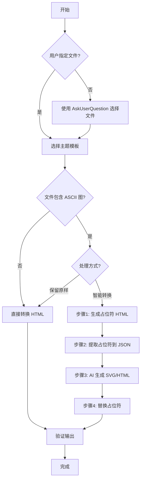

# Converting Markdown to HTML

将 Markdown 文档转换为美观的 HTML，支持多主题切换，适合领导查阅和展示。

## Quick Start

```bash
# 指定文件，使用默认主题（purple）
python3 scripts/convert.py document.md

# 指定文件和主题
python3 scripts/convert.py document.md --theme blue

# 列出所有可用主题
python3 scripts/convert.py --list-themes
```

## Features

- ✅ **多主题支持**：purple（紫色）、blue（蓝色）、green（绿色）、minimal（极简灰度）
- ✅ 响应式设计（PC/平板/手机）
- ✅ 打印优化（自动移除渐变和阴影）
- ✅ **智能段落合并**：使用专业库，无多余`<br>`标签
- ✅ **ASCII图清晰显示**：用等宽字体保留，结构准确
- ✅ **智能 SVG 转换**：AI Agent 将 ASCII 图转换为精美 SVG/HTML
- ✅ 稳定的转换逻辑（Python 脚本，依赖 markdown + PyYAML）

---

## ⚠️ 重要约束：UI 图必须静态展示

**对于 UI 类型的 ASCII 图（弹出窗、对话框、表单等）：**

❌ **禁止：**
- 使用 JavaScript 控制显示/隐藏
- 使用 `onclick`、`onhover` 等事件处理
- 使用 `display: none` 隐藏内容
- 需要用户交互才能看到完整内容
- **生成完整的 HTML 文档**（包含 `<html>`, `<head>`, `<body>`, `<!DOCTYPE>` 等标签）

✅ **必须：**
- **所有内容直接显示在文档中**
- 使用纯 HTML/CSS，不用 JavaScript
- **生成 HTML 片段（fragment）**，只包含 UI 组件代码
- 目标是**展示设计效果**，不是实现功能
- 适合打印和导出 PDF

**⚠️ HTML 片段规范：**
- ✅ 允许：`<div>`, `<button>`, `<span>`, `<p>`, `<h1>`~`<h6>` 等标签
- ✅ 允许：内联 `style` 属性和 `<style>` 标签
- ❌ 禁止：`<html>`, `<head>`, `<body>`, `<!DOCTYPE>` 等顶层标签
- ❌ 禁止：`<script>` 标签（内联或外部脚本）和事件处理属性
- 原因：生成的代码会被插入到已有的 HTML 文档中，包含顶层标签会导致标签嵌套错误

---

## Available Themes

| Theme | Name | Colors | Use Case |
|-------|------|--------|----------|
| **purple** | 紫色渐变主题 | #667eea → #764ba2 | 售前方案、商务文档 |
| **blue** | 蓝色科技主题 | #1890ff → #096dd9 | 技术文档、API 文档 |
| **green** | 绿色清新主题 | #52c41a → #389e0d | 内部报告、运营数据 |
| **minimal** | 极简灰度主题 | 灰度系 | 学术论文、正式报告 |

---

## Usage

### Command Line Options

```bash
# 基本用法
python3 scripts/convert.py [markdown_file] [options]

# 选项：
#   --theme, -t    主题名称（默认：purple）
#   --list-themes, -l  列出所有可用主题

# 示例：
python3 scripts/convert.py "文档.md"                    # 默认紫色主题
python3 scripts/convert.py "文档.md" --theme blue       # 蓝色主题
python3 scripts/convert.py "文档.md" --theme green      # 绿色主题
python3 scripts/convert.py "文档.md" --theme minimal    # 极简主题
python3 scripts/convert.py --list-themes               # 列出所有主题
```

---

## AI 交互流程

### 流程概述



### 快速参考

| 步骤 | 操作 | 说明 |
|------|------|------|
| **步骤1** | 选择 Markdown 文件 | 使用 `AskUserQuestion` 工具 |
| **步骤2** | 选择主题 | purple/blue/green/minimal |
| **步骤3** | 处理 ASCII 图 | 保留原样 OR 智能转换（3步流程） |
| **步骤4** | 验证输出 | 检查清单见"验证规则"章节 |

---

### ⚠️ AI Agent 执行规范

**执行脚本时的重要规则：**

1. **使用完整路径调用脚本**：确保脚本能被找到
2. **使用完整路径指定输入文件**：避免文件找不到
3. **不要 cd 切换目录**：保持当前工作目录不变
4. **明确输出位置**：告知用户 HTML 文件的生成位置

**❌ 错误示例：**
```bash
# 错误1：切换目录（会改变工作目录）
cd /path/to/skill && python3 scripts/convert.py document.md

# 错误2：使用相对路径（可能找不到文件）
python3 scripts/convert.py ../../document.md
```

**✅ 正确示例：**
```bash
# 方法1：使用绝对路径（推荐）
python3 /path/to/skill/scripts/convert.py /path/to/document.md --theme blue

# 方法2：先 cd 到项目目录，再执行
cd /path/to/project
python3 /path/to/skill/scripts/convert.py document.md --theme blue
```

**执行后告知用户：**
```
✅ 转换完成！
📄 输入文件：/path/to/document.md
📄 输出文件：/path/to/document.html
📊 文件大小：XX KB
💡 提示：HTML 文件与 Markdown 文件在同一目录
```

---

## 处理 ASCII 图

### 检测和类型识别

**支持的 5 种图形类型：**
- `architecture` - 系统架构图
- `flowchart` - 流程图
- `ui` - UI 界面图（⚠️ 输出 HTML，不是 SVG）
- `timeline` - 时间线图
- `diagram` - 通用图

### 处理方式

**如果文档包含 ASCII 图，询问用户处理方式：**

#### 选项1：保留原样
- 直接调用 `python3 scripts/convert.py [file] --theme [theme]`
- ASCII 图用等宽字体显示
- 适合快速预览

#### 选项2：智能转换 SVG/HTML（3 步流程）⭐

**子步骤 1：生成带占位符的 HTML**
```bash
AI_SVG_CONVERSION=true python3 scripts/convert.py [file] --theme [theme]
```

**子步骤 2：提取占位符到 JSON**
```bash
python3 scripts/extract_placeholders.py [file.html]
```

**子步骤 3：AI 生成 SVG/HTML**

**🔴 核心要求：必须有 Task 工具时，使用多 Task 并行生成**

| 方式 | 耗时（8个图） | 说明 |
|------|--------------|------|
| **顺序处理** | ~80秒 | AI 一个接一个生成 |
| **多 Task 并行** | ~20秒 | 多个 Task 同时工作 |

**实现方式：**
1. 读取 extracted.json，获取所有占位符
2. 为每个占位符创建一个 Task（如果平台支持 Task 工具）
3. 所有 Task 并行执行
4. 等待所有 Task 完成，然后调用替换脚本

**质量要求（每个 Task 都必须满足）：**
- ✅ 圆角效果（`rx="8"`）
- ✅ 主题色系（primary、secondary）
- ✅ 字体设置（`font-family`）
- ✅ HTML class 前缀（`[类型]-[ID]-`，避免冲突）
- ✅ SVG 代码长度 > 500 字符（不是简略版）

3. **调用替换脚本**：
   ```bash
   python3 scripts/replace_svg.py .cvt-caches/{document}/{session_id}/extracted.json
   ```

---

## 📖 详细规范和指南（按需加载）

本技能包含以下详细参考资料，AI Agent 仅在需要时加载：

### 📄 输出格式和代码要求
**文件**：`references/output-specs.md`

**包含内容**：
- SVG 输出要求（architecture/flowchart/timeline/diagram）
- HTML 输出要求（ui 类型）
- 质量检查清单
- 错误示例和常见问题

**何时读取**：
- AI 需要生成 SVG/HTML 代码时
- 需要验证代码质量时

---

### 🎨 ASCII 识别和转换技巧
**文件**：`references/ascii-to-svg.md`

**包含内容**：
- 如何识别不同类型的 ASCII 图
- 转换技巧和最佳实践
- 常见问题解决方案

**何时读取**：
- AI 需要理解 ASCII 图结构时
- 需要优化转换效果时

---

### 🔧 技术细节和常见问题
**文件**：`references/technical-details.md`

**包含内容**：
- 转换流程的技术细节
- 缓存管理机制
- 常见错误和解决方案

**何时读取**：
- 遇到技术问题时
- 需要调试转换流程时

---

### 🤖 AI 生成规范
**文件**：`references/ai-generation-specs.md`

**包含内容**：
- AI 生成代码的详细规范
- 并行生成的实现方式
- 质量标准和验证方法

**何时读取**：
- 执行智能转换时
- 需要了解生成要求时

---

## 验证转换结果

**适用范围：** 以下验证清单仅针对 **AI Agent 生成的 SVG/HTML 代码**，不适用于完整 HTML 文档。

### 快速验证清单

生成代码时检查：

**SVG 代码：**
- ✅ 以 `<svg` 开头，`</svg>` 结尾
- ✅ 包含 `xmlns="http://www.w3.org/2000/svg"`
- ✅ 有 `viewBox` 属性（不要用硬编码的 width/height）
- ✅ 使用主题色系（见"配色速查表"）
- ✅ 包含圆角效果（`rx="8"`）
- ✅ 字体设置（`font-family`）

**HTML 代码：**
- ✅ 使用语义化 HTML5 标签（`<div>`, `<button>`, `<input>` 等）
- ✅ **HTML class 必须有前缀**（格式：`[类型]-[ID]-`，如 `ui-1-container`）⚠️
- ✅ **UI 类型必须是静态展示**：
  - ❌ 不使用 `<script>` 标签（内联或外部脚本）
  - ❌ 不使用事件处理属性（onclick、onhover 等）
  - ❌ 不使用 `display:none` 等隐藏内容
  - ❌ 不包含完整 HTML 文档标签（`<html>`, `<head>`, `<body>`, `<!DOCTYPE>`）
  - ✅ 必须是 HTML 片段（可插入到 `<body>` 内部的代码）
  - ✅ 允许使用 `<style>` 标签和内联 `style` 属性
  - ✅ 所有内容直接显示在文档中

**替换后检查：**
```bash
# 检查是否还有未替换的占位符
grep -c "AI-SVG-PLACEHOLDER" output.html
# 输出应该为 0
```

---

## 配色速查表

| 主题 | Primary | Secondary | Background | Text |
|------|---------|-----------|------------|------|
| **purple** | #667eea | #764ba2 | #f8f9fa | #333333 |
| **blue** | #1890ff | #096dd9 | #f0f5ff | #333333 |
| **green** | #52c41a | #389e0d | #f6ffed | #333333 |
| **minimal** | #333333 | #666666 | #ffffff | #333333 |

---

## Examples

### 基础用法

```bash
# 转换单个文件
python3 scripts/convert.py document.md

# 指定主题
python3 scripts/convert.py document.md --theme blue

# 列出主题
python3 scripts/convert.py --list-themes
```

### 智能转换流程

```bash
# 步骤1：生成占位符
AI_SVG_CONVERSION=true python3 scripts/convert.py document.md --theme purple

# 步骤2：提取占位符
python3 scripts/extract_placeholders.py document.html

# 步骤3：AI 生成 SVG/HTML 并替换
python3 scripts/replace_svg.py document.json
```
