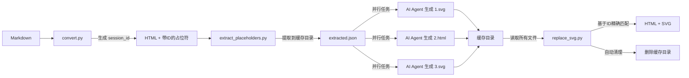

# 技术细节

本文档提供 converting-markdown 的完整技术细节、依赖安装和故障排查指南。

## 依赖安装

### 必需依赖

```bash
# 安装 Python 依赖
pip3 install pyyaml markdown
```

**依赖说明：**
- **PyYAML**：解析主题配置文件（YAML 格式）
- **markdown**：将 Markdown 转换为 HTML

### Python 版本要求

- **最低版本**：Python 3.6
- **原因**：使用了 f-string 语法（Python 3.6+ 特性）

```bash
# 检查 Python 版本
python3 --version
```

## 文件编码规范

### 输入文件编码
- **格式**：Markdown (.md)
- **编码**：UTF-8
- **BOM**：不推荐（可能导致问题）

### 输出文件编码
- **格式**：HTML5
- **编码**：UTF-8
- **换行符**：LF（Unix 风格，\\n）

### 编码问题处理

如果遇到编码错误，转换文件编码：

```bash
# 从 GBK 转换为 UTF-8
iconv -f GBK -t UTF-8 input.md > output.md

# 使用 file 命令检查编码
file -I input.md
```

## 主题配置格式

### YAML 文件结构

每个主题文件位于 `templates/` 目录，包含以下部分：

```yaml
# 颜色配置
colors:
  primary: "#667eea"        # 主色
  secondary: "#764ba2"      # 辅助色
  background: "#f3f3ff"     # 背景色
  text: "#333333"           # 文本色
  border: "#d3d3ff"         # 边框色

# 样式配置
styles:
  border_radius: 8          # 圆角大小
  shadow: true              # 是否启用阴影
  shadow_blur: 3            # 阴影模糊度
  shadow_offset: 2          # 阴影偏移

# 字体大小
font_sizes:
  h1: 32                    # 一级标题
  h2: 28                    # 二级标题
  h3: 24                    # 三级标题
  body: 16                  # 正文

# 间距配置
spacing:
  paragraph_margin: 16      # 段落间距
  line_height: 1.6          # 行高

# 渐变定义
gradients:
  header:
    start: "#667eea"
    end: "#764ba2"
    angle: 135               # 渐变角度

# 特殊样式
special_styles:
  table:
    header_gradient: true
    striped: true
  code:
    background: "#f5f5f5"
    border_radius: 4
  blockquote:
    border_left: true
    background: true
```

### 添加自定义主题

```bash
# 1. 复制现有主题作为模板
cp templates/purple.yaml templates/mytheme.yaml

# 2. 编辑 mytheme.yaml，修改颜色和样式

# 3. 立即使用
python3 scripts/convert.py document.md --theme mytheme
```

## 故障排查

### 问题 1：编码错误

**现象：**
```
UnicodeDecodeError: 'utf-8' codec can't decode byte 0xc0 in position 10
```

**原因**：Markdown 文件不是 UTF-8 编码

**解决方案：**
```bash
# 方案1：转换文件编码
iconv -f GBK -t UTF-8 input.md > input_utf8.md

# 方案2：使用 UTF-8 重新保存
# 在编辑器中选择 "UTF-8" 编码重新保存
```

---

### 问题 2：找不到文件

**现象：**
```
FileNotFoundError: [Errno 2] No such file or directory: 'document.md'
```

**原因**：使用了相对路径或路径错误

**解决方案：**
```bash
# ❌ 错误：使用相对路径
python3 scripts/convert.py ../../document.md

# ✅ 正确：使用绝对路径
python3 /full/path/to/scripts/convert.py /full/path/to/document.md --theme blue

# ✅ 正确：先 cd 到项目目录
cd /path/to/project
python3 /path/to/skill/scripts/convert.py document.md --theme blue
```

---

### 问题 3：主题未找到

**现象：**
```
KeyError: 'mytheme'
```

**原因**：主题名称拼写错误或文件不存在

**解决方案：**
```bash
# 1. 列出所有可用主题
python3 scripts/convert.py --list-themes

# 2. 确认主题文件存在
ls templates/

# 3. 使用正确的主题名称
python3 scripts/convert.py document.md --theme purple  # 不是 purple.yaml
```

---

### 问题 4：依赖缺失

**现象：**
```
ModuleNotFoundError: No module named 'yaml'
ModuleNotFoundError: No module named 'markdown'
```

**原因**：未安装依赖

**解决方案：**
```bash
# 安装所有必需依赖
pip3 install pyyaml markdown

# 验证安装
python3 -c "import yaml; import markdown; print('依赖已安装')"
```

---

### 问题 5：SVG 未显示

**现象**：HTML 中有 SVG 代码但不显示

**可能原因及解决方案：**

#### 原因1：SVG 格式错误
```xml
<!-- ❌ 错误：缺少 xmlns -->
<svg width="100" height="100">
  <rect x="10" y="10" width="80" height="80" fill="red"/>
</svg>

<!-- ✅ 正确：包含 xmlns -->
<svg width="100" height="100" xmlns="http://www.w3.org/2000/svg">
  <rect x="10" y="10" width="80" height="80" fill="red"/>
</svg>
```

#### 原因2：viewBox 设置错误
```xml
<!-- ❌ 错误：硬编码尺寸，不响应式 -->
<svg width="800px" height="400px">
  <!-- 内容 -->
</svg>

<!-- ✅ 正确：使用 viewBox -->
<svg width="100%" style="max-width: 800px" viewBox="0 0 800 400">
  <!-- 内容 -->
</svg>
```

#### 原因3：标签未闭合
```xml
<!-- ❌ 错误：标签未闭合 -->
<svg>
  <rect x="10" y="10" width="80" height="80"/>

<!-- ✅ 正确：所有标签闭合 -->
<svg xmlns="http://www.w3.org/2000/svg">
  <rect x="10" y="10" width="80" height="80"/>
</svg>
```

---

### 问题 6：占位符未被替换

**现象：** HTML 中还有 `AI-SVG-PLACEHOLDER` 标记

**原因**：
- AI Agent 未生成 SVG 代码
- JSON 文件未保存
- 未调用替换脚本

**解决方案：**
```bash
# 1. 检查 JSON 文件是否生成
ls document.json

# 2. 检查 JSON 中是否有 svg_code
cat document.json | grep "svg_code"

# 3. 手动调用替换脚本
python3 scripts/replace_svg.py document.json

# 4. 验证替换结果
grep -c "AI-SVG-PLACEHOLDER" document.html
# 输出应该为 0
```

---

### 问题 7：转换后样式丢失

**现象：** HTML 缺少主题样式

**可能原因：**
- 主题文件路径错误
- YAML 语法错误
- 脚本未正确加载主题

**解决方案：**
```bash
# 1. 验证主题文件存在
ls templates/purple.yaml

# 2. 验证 YAML 语法
python3 -c "import yaml; yaml.safe_load(open('templates/purple.yaml'))"

# 3. 使用 --list-themes 检查主题
python3 scripts/convert.py --list-themes

# 4. 尝试其他主题
python3 scripts/convert.py document.md --theme blue
```

---

## 开发者调试

### 启用详细日志

```bash
# 在 Python 脚本中添加调试输出
python3 -c "
import sys
sys.path.insert(0, 'scripts')
import convert
convert.logger.setLevel('DEBUG')
"
```

### 验证输出

```bash
# 1. 检查 HTML 文件大小
ls -lh document.html

# 2. 检查 HTML 结构
head -50 document.html

# 3. 在浏览器中打开
# macOS
open document.html

# Linux
xdg-open document.html

# Windows
start document.html
```

---

## 技术架构

### 脚本职责分离

```
converting-markdown/
├── scripts/
│   ├── convert.py              # 主转换逻辑（生成 session_id 和带 ID 的标记）
│   ├── themes.py               # 主题加载
│   ├── extract_placeholders.py # 占位符提取到缓存目录
│   └── replace_svg.py          # 从缓存目录读取并替换（自动清理）
├── templates/                  # 主题配置
│   ├── base.yaml               # 基础样式
│   ├── purple.yaml             # 紫色主题
│   ├── blue.yaml               # 蓝色主题
│   ├── green.yaml              # 绿色主题
│   └── minimal.yaml            # 极简主题
└── guides/                     # 技术指南
    ├── output-specs.md         # 输出规范
    ├── ascii-to-svg.md         # ASCII 识别技巧
    └── technical-details.md     # 本文档

# 运行时生成的缓存目录（自动清理）
.cvt-caches/                     # 缓存根目录（在文档所在目录）
└── {文档名}/                    # 按文档分组
    └── {session_id}/            # 6位随机会话ID（如：a1b2c3）
        ├── extracted.json       # 占位符映射文件
        ├── 1.svg                # AI Agent 并行生成
        ├── 2.html
        └── ...
```

### 数据流（并行优化版）



### 关键技术实现

#### 1. session_id 生成（convert.py）

```python
import random
import string

# 生成 6 位随机会话 ID（十六进制字符）
session_id = ''.join(random.choices('abcdef0123456789', k=6))

# 创建缓存目录：.cvt-caches/{文档名}/{session_id}/
caches_dir = md_path.parent / '.cvt-caches' / doc_name / session_id
caches_dir.mkdir(parents=True, exist_ok=True)
```

#### 2. 带 ID 的占位符标记（convert.py）

```python
# 生成带 id 和 session 的唯一标记
svg_content = f'''<!-- AI-SVG-ARCHITECTURE-START:id={placeholder_id},session={session_id} -->
<div class="ai-svg-placeholder" data-id="{placeholder_id}" data-session="{session_id}">
  ...
</div>
<!-- AI-SVG-ARCHITECTURE-END:id={placeholder_id},session={session_id} -->'''
```

#### 3. 缓存目录提取（extract_placeholders.py）

```python
# 提取 id 和 session_id
start_pattern = r'<!-- AI-SVG-(\w+)-START:id=(\d+),session=([a-f0-9]+) -->'

# 输出 JSON 到缓存目录
json_file = html_path.parent / '.cvt-caches' / document_name / session_id / 'extracted.json'
```

#### 4. 基于 ID 的精确匹配（replace_svg.py）

```python
# 从缓存目录读取文件
cache_file = caches_dir / f"{placeholder_id}.svg"  # 或 .html

# 使用带 id 和 session 的标记精确匹配
pattern = rf'(<!-- AI-SVG-{diagram_type}-START:id={placeholder_id},session={session_id} -->).*?(<!-- AI-SVG-{diagram_type}-END:id={placeholder_id},session={session_id} -->)'
```

### 并发安全性

| 层级 | 隔离机制 | 冲突概率 |
|------|---------|---------|
| **文档级** | `{文档名}/` | 不同文档完全隔离 |
| **会话级** | `{session_id}/` | 16^6 = 16,777,216 种组合 |
| **占位符级** | `{id}.svg/.html` | 数字 ID，同会话内唯一 |

---

## 常见使用场景

### 场景1：快速转换（保留 ASCII）

```bash
python3 scripts/convert.py document.md --theme blue
```

**输出：** HTML 文件，ASCII 图用等宽字体显示

---

### 场景2：智能转换（SVG/HTML）- 并行优化

```bash
# 步骤1：生成带占位符的 HTML（带 ID 和 session_id）
AI_SVG_CONVERSION=true python3 scripts/convert.py document.md --theme purple
# 输出：document.html + 缓存目录创建

# 步骤2：提取占位符到 JSON（输出到缓存目录）
python3 scripts/extract_placeholders.py document.html
# 输出：.cvt-caches/{文档名}/{session_id}/extracted.json

# 步骤3：AI Agent 并行生成（支持多任务加速）
# 3.1 读取 extracted.json，获取 session_id 和占位符列表
# 3.2 并行为每个占位符生成 SVG/HTML 代码
# 3.3 保存到独立文件：.cvt-caches/{文档名}/{session_id}/{id}.svg 或 .html
# 示例（AI Agent 内部并行）：
#   - 任务1：生成 1.svg → 保存到缓存目录
#   - 任务2：生成 2.html → 保存到缓存目录
#   - 任务3：生成 3.svg → 保存到缓存目录

# 步骤4：替换占位符并清理缓存
python3 scripts/replace_svg.py .cvt-caches/{文档名}/{session_id}/extracted.json
# 从缓存目录读取所有生成文件，基于 ID 精确匹配并替换
# 自动清理缓存目录
```

**输出：** HTML 文件，ASCII 图转换为精美 SVG/HTML

**性能提升：**
- 8 个图：~80 秒 → ~10-15 秒（**5-8倍加速**）
- 支持真正的并行生成，无单点写入瓶颈

---

## 性能优化建议

### 大文件处理

- **文件大小限制**：<10MB Markdown 文件
- **ASCII 图数量**：<50 个
- **SVG 复杂度**：建议简单架构图，避免过于复杂

### 并行生成优化

**架构对比：**

| 方案 | 写入方式 | 8个图耗时 | 加速比 |
|------|---------|----------|--------|
| **顺序处理** | AI 逐个生成 | ~80 秒 | 1x |
| **多 Task 并行** | 并行写入文件系统 | ~10-15 秒 | 5-8x |

**实现原理：**
1. 每个 SVG/HTML 保存到独立文件（`{id}.svg` 或 `{id}.html`）
2. AI Agent 可以并行处理多个占位符
3. 文件系统自然支持并发写入，无锁冲突
4. 基于 ID 精确匹配，不依赖数组顺序

**适用场景：**
- ✅ 多个简单架构图（4-10 个）
- ✅ 混合类型（SVG + HTML）
- ✅ 需要快速预览或迭代

### 批量转换

```bash
# 批量转换多个文件
for file in *.md; do
  python3 scripts/convert.py "$file" --theme purple
done
```

---

## 参考资源

- **Markdown 规范**：https://commonmark.org/
- **SVG 规范**：https://www.w3.org/TR/SVG/
- **CSS Flexbox**：https://css-tricks.com/snippets/css/a-guide-to-flexbox/
- **Python YAML**：https://pyyaml.org/wiki/PyYAMLDocumentation
