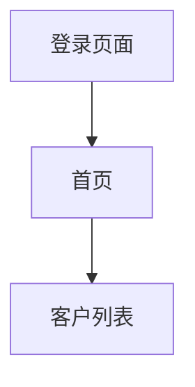

# Fast Prototype

Transform product requirements into structured PRD, interactive prototype, and professional documentation.

## Quick Start

```
User requirement → Structured PRD → User confirmation → Prototype + Documents
```

## Workflow

### Stage 1: Requirement Collection

Receive natural language requirement description. Ask clarifying questions if needed:
- Target audience
- Core features
- Number of main pages
- Reference products

### Stage 2: Generate Structured PRD

Generate structured PRD with three components:

**1. Mermaid Flowchart** (Page navigation logic)



**2. ASCII UI Layout** (Must use `ui` type annotation)

````markdown
```ascii:ui
+-----------------------+
|      登录页面         |
+-----------------------+
| 账号: [________]      |
| 密码: [________]      |
+-----------------------+
```
````

**3. Element Function Table**

| Page | Element | Type | Function |
|------|---------|------|----------|
| Login | Username input | Input | Enter username |
| Login | Password input | Input | Enter password |

### Stage 3: User Confirmation

Show the structured PRD and ask if modifications are needed.

If confirmed no changes, proceed to Stage 4.

### Stage 4: Generate Interactive Prototype

Generate single-file HTML with:
- **Framework**: Vue 3 (CDN)
- **Styling**: Tailwind CSS (CDN)
- **Components**: Element Plus (CDN)
- **Routing**: Vue Router (CDN)

File naming: `[Product Name]-prototype.html`

**Component patterns**: See [references/component-styles.md](references/component-styles.md)

### Stage 5: Generate Documentation

Ask which documents to generate:
- Standard PRD document
- Interface design document
- Frontend technical document
- Backend technical document

**PRD template**: [references/prd-template.md](references/prd-template.md)
**Design specs**: [references/design-specs.md](references/design-specs.md)
**Frontend template**: [references/frontend-tech.md](references/frontend-tech.md)
**Backend template**: [references/backend-tech.md](references/backend-tech.md)

---

## Technical Stack

- **Framework**: Vue 3 Composition API
- **Styling**: Tailwind CSS
- **Components**: Element Plus
- **Router**: Vue Router 4
- **Build**: Single HTML file (no build step)

---

## Quality Checklist

### Structured PRD

- [ ] Mermaid flowchart included
- [ ] ASCII UI layouts with `ui` type annotation
- [ ] Complete element function table
- [ ] User confirmed before proceeding

### Interactive Prototype

- [ ] Vue 3 + Tailwind + Element Plus used
- [ ] All page navigation implemented
- [ ] Interactive elements functional
- [ ] Runs directly in browser
- [ ] Modern, responsive design

### Documentation

- [ ] Standard PRD: 6 major sections complete
- [ ] Design doc: Designer can execute from it
- [ ] Frontend doc: Developer can build from it
- [ ] Backend doc: Developer can implement from it

---

## Common Patterns

### When user requirement is too simple

Ask for:
- Target audience
- Core features
- Page count
- Reference products

### When user wants modifications but unclear

Provide options:
- Modify flowchart
- Modify UI layout
- Modify function table
- Add page
- Delete page

### When prototype code is too complex for single file

- For simple prototypes: Keep single-file
- For complex prototypes: Inform user that multi-file structure is recommended
