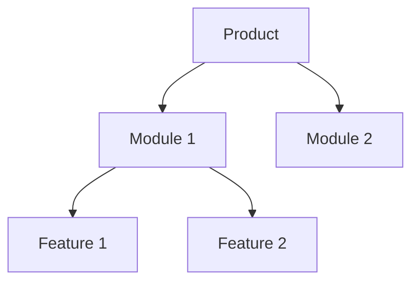
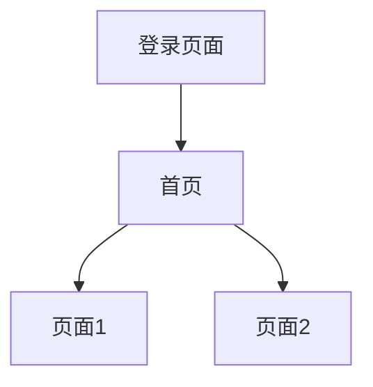
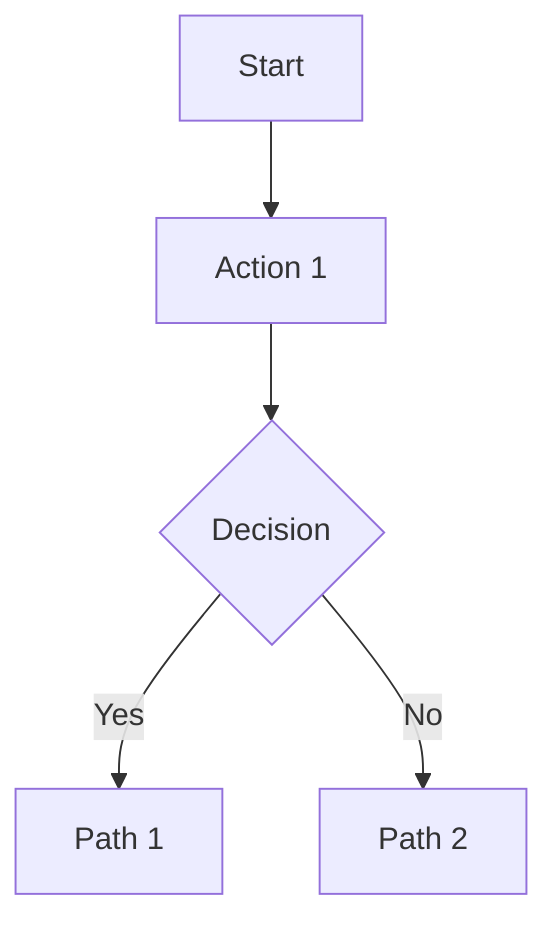

# PRD Document Template

Standard structure for Product Requirements Document.

---

## Document Structure

```markdown
# [Product Name] Product Requirements Document

## 1. Product Overview
### 1.1 Background
### 1.2 Goals
### 1.3 Target Users

## 2. Functional Requirements
### 2.1 Feature Architecture
### 2.2 Feature Details

## 3. Page Design
### 3.1 Page Flowchart
### 3.2 Page Details

## 4. Interaction Design
### 4.1 Interaction Flows
### 4.2 Exception Handling

## 5. Non-Functional Requirements
### 5.1 Performance
### 5.2 Security
### 5.3 Compatibility

## 6. Version Planning
### 6.1 MVP
### 6.2 Future Versions
```

---

## Section Details

### 1. Product Overview

**1.1 Background**
- Market现状
- User pain points
- Business需求
- Competitor分析

**1.2 Goals**
- Short-term (3 months)
- Medium-term (6-12 months)
- Long-term (1-3 years)

**1.3 Target Users**

| User Type | Description | Core Needs | Scenarios |
|-----------|-------------|------------|-----------|
| Type 1 | Description | Need 1, Need 2 | Scenario 1, 2 |

### 2. Functional Requirements

**2.1 Feature Architecture**

Use Mermaid diagram:



**2.2 Feature Details**

For each feature:

| Feature | Description | Priority | Notes |
|---------|-------------|----------|-------|
| Feature 1 | Description | P0 | MVP必做 |
| Feature 2 | Description | P1 | Important |
| Feature 3 | Description | P2 | Nice to have |

**Detailed description**:

**Feature Name**
- Function description
- User flow
- Edge cases
- Validation rules

### 3. Page Design

**3.1 Page Flowchart**



**3.2 Page Details**

For each page:

**Page Name**
- Page purpose
- Page elements
- Interaction logic
- Exception handling

| Element | Type | Function |
|---------|------|----------|
| Element 1 | Input | Description |
| Element 2 | Button | Description |

**Interaction flow**:
1. User action 1
2. System response 1
3. User action 2
4. System response 2

**Exception handling**:
- Error case 1 → Error message
- Error case 2 → Retry option

### 4. Interaction Design

**4.1 Interaction Flows**

For key interactions:



**4.2 Exception Handling**

| Exception | Handling | User Feedback |
|-----------|----------|---------------|
| Network error | Retry | "网络连接失败，请重试" |
| Validation error | Show error | Field-level error |
| Permission error | Redirect | "无权限访问" |

### 5. Non-Functional Requirements

**5.1 Performance**

| Metric | Requirement | Notes |
|--------|-------------|-------|
| Page load | < 2s | First screen |
| API response | < 500ms | Average |
| Concurrent users | > 1000 | Peak |

**5.2 Security**

- Authentication: JWT token
- Authorization: RBAC
- Data encryption: HTTPS + AES
- Password: bcrypt

**5.3 Compatibility**

| Category | Requirement |
|----------|-------------|
| Browser | Chrome, Firefox, Safari, Edge (latest) |
| Device | PC, Tablet, Mobile |
| Resolution | 1920×1080, 1366×768, 375×667 |

### 6. Version Planning

**6.1 MVP (v1.0)**

Timeline: 3 months

Scope:
- Core feature 1
- Core feature 2
- Core feature 3

**6.2 Future Versions**

v1.1 (MVP + 1 month)
- New feature 1
- New feature 2

v1.2 (MVP + 3 months)
- Advanced feature 1
- Advanced feature 2

v2.0 (MVP + 6 months)
- Major feature 1
- Mobile app

---

## Appendix

### Terminology

| Term | Description |
|------|-------------|
| PRD | Product Requirements Document |
| MVP | Minimum Viable Product |
| RBAC | Role-Based Access Control |

### References

- Competitor analysis report
- User research report
- Technical architecture document

### Change Log

| Version | Date | Changes | Author |
|---------|------|---------|--------|
| v1.0 | 2024-01-01 | Initial | Name |
